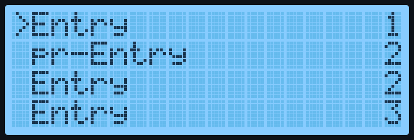
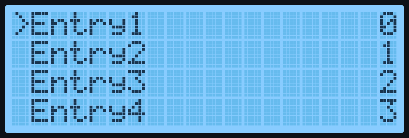

# RotaryMenu Documentation

This Library uses lists of strings or [DynamicSlots](#DynamicSlots) 
to display menu slots on an LCD Char display using 
the [RPLCD](https://github.com/dbrgn/RPLCD/) Library and the [rpi-rotary-encoder-python](https://github.com/nstansby/rpi-rotary-encoder-python)
module.

To start, import the needed library's:
```python
from pathlib import Path
from RPLCD.i2c import CharLCD
from RotaryMenu.RotaryMenuClasses import *
```

# Table of Content
<!-- TOC -->
* [RotaryMenu Documentation](#rotarymenu-documentation)
* [Table of Content](#table-of-content)
* [Slots](#slots)
  * [Slots using Strings](#slots-using-strings)
  * [DynamicSlots](#dynamicslots)
* [MenuTypes](#menutypes)
  * [MenuMain](#menumain)
    * [change_slot()](#changeslot)
  * [MenuSub](#menusub)
  * [MenuFile](#menufile)
    * [files_to_slots()](#filestoslots)
    * [return_to_parent()](#returntoparent)
    * [set_path()](#setpath)
    * [move_to_dir()](#movetodir)
    * [return_to_default()](#returntodefault)
    * [update_slots()](#updateslots)
* [RotaryMenu](#rotarymenu)
  * [return_max_index()](#returnmaxindex)
  * [return_max_shift()](#returnmaxshift)
  * [return_max_cursor_pos()](#returnmaxcursorpos)
  * [get_backed_slots()](#getbackedslots)
  * [if_overflow()](#ifoverflow)
  * [set()](#set)
  * [cursor()](#cursor)
  * [reset_cursor()](#resetcursor)
  * [update_current_slot()](#updatecurrentslot)
  * [menu()](#menu)
  * [reset_menu()](#resetmenu)
<!-- TOC -->

# Slots

Slots are lists containing strings or [DynamicSlots](#dynamicslots), they have
to contain two substrings of "#+#" to display them on the CharLCD.

The substring: "#+#" works as a divider, everything before the first divider is used as the Prefix,
the substring in the middle as the actual entry and everything after the last divider the Suffix.

## Slots using Strings

A string has to contain two "#+#" as mentioned before, it should look something
like this:
```python
slots_menu = ["#+#Entry#+#1", "pr-#+#Entry#+#2", "#+#Entry#+#2", "#+#Entry#+#3"]
```

When used with a [MenuType](#menutypes) subclass and a [RotaryMenu](#rotarymenu) class a 20x4 CharLCD would display this:




## DynamicSlots

[DynamicSlots](#dynamicslots) are Slots that update themselves based on return 
functions. They contain a string with  format brackets:

```python
from RotaryMenu.RotaryMenuClasses import *

entry_names = ["Entry1", "Entry2", "Entry3", "Entry4"]
count = 0

def return_entry_name(index):
    return entry_names[index]

def return_count():
    global count
    count += 1
    return count - 1

menu_slots = [DynamicSlot("#+#{en}#+#{c}", en=return_entry_name,
                          en_args=(0,), c=return_count),
              DynamicSlot("#+#{en}#+#{c}", en=return_entry_name,
                          en_args=(1,), c=return_count),
              DynamicSlot("#+#{en}#+#{c}", en=return_entry_name,
                          en_args=(2,), c=return_count),
              DynamicSlot("#+#{en}#+#{c}", en=return_entry_name,
                          en_args=(3,), c=return_count)
              ]
```
which results in:



# MenuTypes

To display the slots you need an Instance of MenuType which currently has three subclasses.
Every Menu needs a value_callback function like this:

````python
from RotaryMenu.RotaryMenuClasses import *

def menu_value_callback(callback_type, value, menu):
    pass
````
This function is called, for example, when the button is pressed.

Here are all possible callback_types and values:

| **callback_type** | **value**                                  |
|-------------------|--------------------------------------------|
| "setup"           | `"none"`                                   |
| "after_setup"     | `"none"`                                   |
| "press"           | int based on current index                 |
| "dir_press"       | pathlib.Path with path to directory        |
| "file_press"      | pathlib.path with path to file             |
| "direction"       | `"L"` or  `"R"` based on direction rotated |


The menu argument is the RotaryMenu that called the callback

## MenuMain
| **argument**         | **description**                                                                             | **default value** |
|----------------------|---------------------------------------------------------------------------------------------|-------------------|
| slots                | list of strings or [DynamicSlots](#dynamicslots) to display                                 |                   |
| value_callback       | a function for value callbacks                                                              |                   |
| do_setup_callback    | if True, a callback with callback_type "setup" will be called before this menu is set       | `False`           |
| after_reset_callback | if True, a callback with callback_type "after_setup" will be called before this menu is set | `False`           |
| custom_cursor        | if True, normal cursor behavior will be disabled                                            | `False`           |

This subclass of MenuTypes is ment to be used in the [RotaryMenu](#rotarymenu) classes menu parameter.
To this point it has no difference to [MenuSub](#menusub) classes.

````python
from RotaryMenu import *
main_menu_slots = ["#+#Entry1#+#", "#+#Entry2#+#", "#+#Entry4", "#+#Entry5#+#"]

def main_menu_callback(callback_type, value, menu):
    pass

main_menu = MenuMain(main_menu_slots, main_menu_callback, do_setup_callback=True)
````
### change_slot()
| **argument** | **description**                                                        | **default value** |
|--------------|------------------------------------------------------------------------|-------------------|
| index        | the index of the slot to change                                        |                   |
| slot         | a string or [DynamicSlot](#DynamicSlots) the slot should be changed to |                   |

This method works for all [MenuType](#menutypes) subclasses and changes the value of a slot, to update the slot use the [update_current_slot()](#updatecurrentslot) method,
the [menu()](#menu) method can also be used if multiple slots changed.

````python
main_menu.change_slot(1, "#+#Slot Changed!#+#")
````

## MenuSub
| **argument**         | **description**                                                                             | **default value** |
|----------------------|---------------------------------------------------------------------------------------------|-------------------|
| slots                | list of strings or [DynamicSlots](#dynamicslots) to display                                 |                   |
| value_callback       | a function for value callbacks                                                              |                   |
| do_setup_callback    | if True, a callback with callback_type "setup" will be called before this menu is set       | `False`           |
| after_reset_callback | if True, a callback with callback_type "after_setup" will be called before this menu is set | `False`           |
| custom_cursor        | if True, normal cursor behavior will be disabled                                            | `False`           |

The [MenuSub](#menusub) subclass is the most used in menu navigation, at the moment it has no difference to the [MenuMain](#menumain)
subclass but that will be changed in near future
````python
from RotaryMenu import *
sub_menu_slots = ["sub#+#Entry1#+#", "sub#+#Entry2#+#", "sub#+#Entry4", "sub#+#Entry5#+#"]

def sub_menu_callback(callback_type, value, menu):
    pass

sub_menu = MenuMain(main_menu_slots, main_menu_callback, do_setup_callback=True)
````
## MenuFile

| **argument**            | **description**                                                                                  | **default value** |
|-------------------------|--------------------------------------------------------------------------------------------------|-------------------|
| path                    | a pathlib.Path for the starting path and default path                                            |                   |
| value_callback          | a function for value callbacks                                                                   |                   |
| extension_filter        | a list of strings containing file extensions to show                                             | `[".py"]`         |
| show_folders            | if True, shows folders                                                                           | `True`            |
| pr_slots                | list of strings or [DynamicSlots](#dynamicslots) to display before the files and directory's     | `None`            |
| dir_affix               | string to determine prefix and suffix                                                            | `"#+#"`           |
| custom_folder_behaviour | if True, pressing on folders returns their path as a dir_press callback                          | `False`           |
| do_setup_callback       | if True, a callback with callback_type "setup" will be called before this menu is set            | `False`           |
| after_reset_callback    | if True, a callback with callback_type "after_setup" will be called before this menu is set      | `False`           |
| custom_cursor           | if True, normal cursor behavior will be disabled                                                 | `False`           |
| **kwargs                | if the key contains a file extension plus _affix the value is used to determine prefix and affix |                   |

The [MenuFile](#menufile) subclass is used to display your filesystem, pressing on a filename results in a return to value_callback with the
callback_type "file_press" and the path of the file as the value, this can be used to start scripts ect.

````python
from RotaryMenu import *
from pathlib import Path

path = Path("user/example_path/")
file_menu_pr_slots = ["#+#Entry1#+#"]

file_menu_callback(callback_type, value, menu):
    pass

file_menu = MenuFile(path, file_menu_callback, pr_slots=file_menu_pr_slots, do_setup_callback=True,
                     dir_affix="dir:#+#", .py_affix="script:#+#")
````
### files_to_slots()

To make this work the files/ directories are converted to the slots format. Using this method returns the files and directories 
in the slots format with the set prefix and suffix.
````python
print(file_menu.files_to_slots())
>>>["dir:#+#test_directory#+#", "script:#+#test_script.py", "script#+#script2.py"]
````

### return_to_parent()

To navigate through the file system you can use methods like this, the [RotaryMenu](#rotarymenu) class already has built
in navigation but these methods could be needed in other ways.
````python
print(file_menu.current_path)
file_menu.return_to_parent()
print(file_menu.current_path)
>>>"user/example_path/"
>>>"user/"
````
### set_path()

| **argument**    | **description**                         | **default value** |
|-----------------|-----------------------------------------|-------------------|
| path            | pathlib.Path to set the current_path to |                   |
| file_menu_depth | int to set the file menu depth to       | `None`            |

With the [set_path()](#setpath) method is navigating to other directories possible, in case you have to move to a
directory in a totally different location you can use this method.
````python
different_path = Path(user/different_directory/)

print(file_menu.current_path)
file_menu.set_path(different_path)
print(file_menu.current_path)
>>>"user/example_path/"
>>>"user/different_directory/"
````
### move_to_dir()
| **argument** | **description**                                  | **default value** |
|--------------|--------------------------------------------------|-------------------|
| dir_name     | string with the name of the directory to move to |                   |

This method is useful to navigate in a [MenuFile](#menufile) instance. With it, you can also access hidden subdirectories.

````python
print(file_menu.current_path)
file_menu.move_to_dir("test_directory")
print(file_menu.current_path)
>>>"user/example_path/"
>>>"user/example_path/example_directory"
````

### return_to_default()
 
The [return_to_default()](#returntodefault) method returns to the default path and is helpful if you want to go back through multiple parents.
````python
print(file_menu.current_path)
file_menu.return_to_default()
print(file_menu.current_path)
>>>"user/example_path/test_directory/"
>>>"user/example_path/"
````

### update_slots()

This method is used to update the slots after a pr_/ or fmd0_slot has changed. To update the display, the method 
[menu()](#menu) can be used.
````python
print(file_menu.slots)
file_menu.fmd0_slots.append("#+#FMD0-Slot#+#")
file_menu.update_slots()
print(file_menu.slots)
>>>["#+#Entry1#+#", "dir:#+#test_directory#+#", "script:#+#test_script.py", "script#+#script2.py"]
>>>["#+#Entry1#+#", "#+#FMD0-Slot#+#", "dir:#+#test_directory#+#", "script:#+#test_script.py", "script#+#script2.py"]
````

# RotaryMenu

The [RotaryMenu](#rotarymenu) class is where all the navigating takes place, to display a menu to a CharLCD you have to 
create an instance of this class.

| **argument** | **description**                        | **default value**                                                                   |
|--------------|----------------------------------------|-------------------------------------------------------------------------------------|
| lcd          | the CharLCD to write to                | `CharLCD(i2c_expander="PCF8574", address=0x27, port=1, cols=20, rows=4, dotsize=8)` |
| left_pin     | the BCM pins number for left rotation  |                                                                                     |
| right_pin    | the BCM pins number for right rotation |                                                                                     |
| button_pin   | the Bcm pins number for button presses |                                                                                     |
| main         | the main menu of this instance         |                                                                                     |
| menu_timeout | timeout timer for this instance        | `0`                                                                                 |
 
````python
from RotaryMenu import *

lcd = CharLCD(i2c_expander="PCF8574", address=0x27, port=1, cols=20, rows=4, dotsize=8)

rotary_menu = RotaryMenu(lcd=lcd, left_pin=4, right_pin=17, button_pin=27, main=main_menu, menu_timeout=10)
````
## return_max_index()

The next three methods are helpful if you want to implement your own navigation using the custom_cursor argument,
the [return_max_index()](#returnmaxindex) method returns the maximal index of the current menu.
````python
print(rotary_menu.return_max_index())
>>>4
````

## return_max_shift()

The [return_max_shift()](#returnmaxshift) method returns the maximal index that the screen can display so there are no
free spots, for a 20x4 CharLCD this value would be the max_index - 4.
````python
print(rotary_menu.return_max_shift())
>>>1
````

## return_max_cursor_pos()

When you want to print your own navigation with the [cursor()](#cursor) method to the display you should use this method to
prevent the cursor moving beyond limits.
````python
print(rotary_menu.return_max_cursor_pos())
>>>3
````

## get_backed_slots()

With this method you can format the current menus slots into the format that gets printed onto the CharLCD and save them
to backed_slots.
````python
rotary_menu.get_backed_slots
print(rotary_menu.backed_slots)
>>>["Entry1             ", "Entry2             ", "Entry3             ", "Entry4             ", "Entry5             "]
````

## if_overflow()

| **argument** | **description**    | **default value** |
|--------------|--------------------|-------------------|
| index        | the index to check |                   |

To check if a slot extends over the colum limit is possible with this method, it returns ether `True` or `False`.
````python
print(rotary_menu.if_overflow(2))
>>>False
````
## set()
| **argument** | **description**    | **default value**        |
|--------------|--------------------|--------------------------|
| menu         | the menu to set to | this instances main menu |

Using [set()](#set) without arguments results the current_menu attribute to be set to the instances main attribute.
if you use a MenuType subclass the current_menu will be set to given menu.
````python
rotary_menu.set(sub_menu)
print(rotary_menu.current_menu.__class__.__name__)
rotary_menu.set()
print(rotary_menu.current_menu.__class__.__name__)
>>>MenuSub
>>>MenuMain
````

## cursor()
| **argument**  | **description**                 | **default value** |
|---------------|---------------------------------|-------------------|
| pr_cursor_pos | previous position of the cursor |                   |

This method can be used when making custom navigation.

## reset_cursor()

If you need to set the cursors position to default you can use this method, it also reduces the index by the amount it 
was reset.


## update_current_slot()

After you changed a Slot with [change_slot()](#changeslot) you need to run this method to apply the changes to the display.
It always changes the slot the cursor is on.

## menu(keep_scroll)

In case you changed more than one slot you can also use this function to update all visible at once.

if keep_scroll is True the scrolled Slot keep its shift when the middle substring doesn't change and the two other 
substrings don't change in length


## reset_menu()

If a slot has been removed you should run this method to prevent problems with the index.
