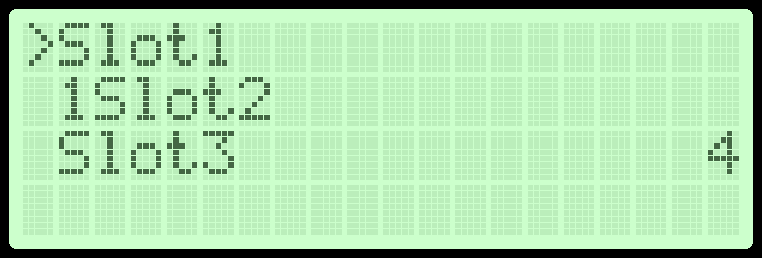
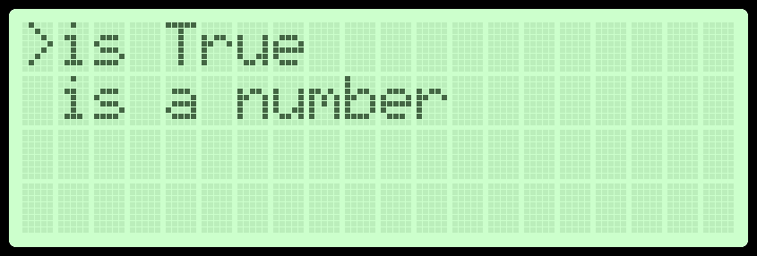

# RotaryMenu Documentation

This Library uses lists of strings or [DynamicSlots](#DynamicSlots) 
to display menu slots on an LCD Char display using 
the [RPLCD](https://github.com/dbrgn/RPLCD/) Library.

# Table of Content


# Slots

Slots are lists containing strings or [DynamicSlots](#DynamicSlots)
## Slots using Strings

To use a string as a Slot it has to be written in a specific way,
each Slot contains two substrings "#+#" as seperator:
```python
slots_menu = ["#+#Slot1#+#", "1#+#Slot2#+#", "#+#Slot3#+#4"]
```

which results a 4x20 Display to display:



## DynamicSlots

DynamicSlots are Slots that update themselves based on return 
functions. They contain a string with  format pretences:

```python
from RotaryMenu.RotaryMenuClasses import *

def return_setting():
    return setting

def return_is_int(value):
    if isinstance(value, int):
        return "is a number"
    else:
        return "is not a number"

setting = True

menu_slots = [DynamicSlot("#+#is {rs}#+#", rs=return_setting),
              DynamicSlot("#+#{rii}#+#", rii=return_is_int, rii_args=(1,))]
```
which results in:
